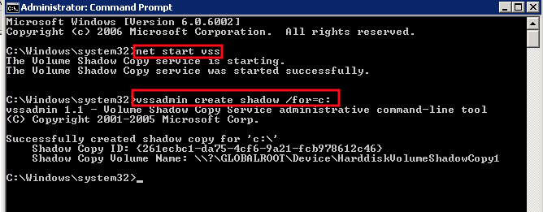
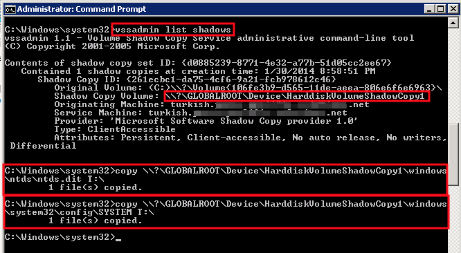

# Extracting password hashes from Active Directory

## Part 1:  Extracting SAM, SYSTEM, and NTDS.dit from the Active Directory Domain Controller

Start the Volume Shadow Copy Service (VSS) if it isn’t already running.

  `net start vss`

Create volume shadow copy of drive containing the target files.

  `vssadmin create shadow /for=c:`
  

List  the volume shadow copies (to make it easier to copy/paste the path).

  `vssadmin list shadows`

Copy the SYSTEM and NTDS.dit files off the target system and to a destination of your choice; the following example copies to the ‘T:\’ drive:
```
copy \\?\GLOBALROOT\Device\HarddiskVolumeShadowCopy1\windows\ntds\ntds.dit T:\

copy \\?\GLOBALROOT\Device\HarddiskVolumeShadowCopy1\windows\system32\config\SYSTEM T:\

copy \\?\GLOBALROOT\Device\HarddiskVolumeShadowCopy1\windows\system32\config\SAM T:\
```



Move these files to your analysis workstation and then stop the Volume Shadow Service

  `net stop vss`

## Part II: Export the Hash database from the NTDS.dit file

1. Create a directory structure for organizing the password analysis using the create-dirs.sh script.  For reference this performs the following:

```
mkdir -p AD-YYYYMM/analysis
mkdir -p AD-YYYYMM/hashes
mkdir -p AD-YYYYMM/raw
mkdir -p AD-YYYYMM/working
```

Where YYYYMM is the date.  E.g. 201709  (for September in 2017)

2. Move the files extracted in Part I to your "raw" directory

3. Install packages

  `apt-get install build-essential autopoint`

4. Download libesdb from [https://github.com/libyal/libesedb](https://github.com/libyal/libesedb)  (get the archive package instead of cloning the repository) and follow these steps to build the package.


  1. cd into the directory and prepare the package
  2. `sudo apt-get install autopoint`
  3. `./synclibs.sh`
  
  4. `./autogen.sh`
  
  5. Build from source:
  
    `./configure && make && make install`
	
  6. Copy the new binaries to /opt:
  
    `cp -r esedtools/ /opt/`
	
  7. From your raw directory, extract the tables from the ntds.dit file, e.g.:
  
    `/opt/esedbtools/esedbexport -t ~/AD-YYYYMM/working ./ntds.dit`
	
  8. this will create an hidden directory called ‘.export’ under your working directory.  All the tables should now be there. 

## Part III:  Extract the hashes from the NTDS.dit file

Once the relevant files have been acquired, the hashes can be extracted from retrieved databases.  The extracts are in the form of username:hash.  (e.g. joeadmin:6cb9be6a42a2b4f0cf3e42415df5a516 )


### Get NTDSExtract.

NTDSExtract can be found on github.  You can either copy it from:

[https://github.com/csababarta/ntdsxtract](https://github.com/csababarta/ntdsxtract)

Or clone the repository

  `git clone https://github.com/csababarta/ntdsxtract.git`

Also, I maintain a [forked copy](https://github.com/ktneely/ntdsxtract).

### Extract the hashes to a file

Use dsusers.py from ntdsxtract to extract the hashes from the Active Directory tables. In this example, I reference the extracted tables that I’ve placed in the working directory, the SYSTEM file, specify Hashcat format, and then specify the output files.  Note that even if you do not exist, you must "extract" and create a file for the LM hashes.

**Example** (the specific file names you use may be different):

`python ./dsusers.py /workingdir/.export/datatable.4 /workingdir/.export/link_table.7 /path/to/workingdir/ --syshive /workingdir/raw/SYSTEM --pwdformat ocl --passwordhashes --lmoutfile /workingdir/hashes/lmpass.out --ntoutfile /workingdir/hashes/ntpass.out`
